<!-- Brand short at repo top: poster is click-to-play → GitHub blob video player (README cannot inline-play repo .mp4). -->
<p align="center">
  <a href="docs/assets/exports/mok-tua-petscii-matrix-export.mp4" title="Open playable PETSCII Matrix export (press play on the file page)">
    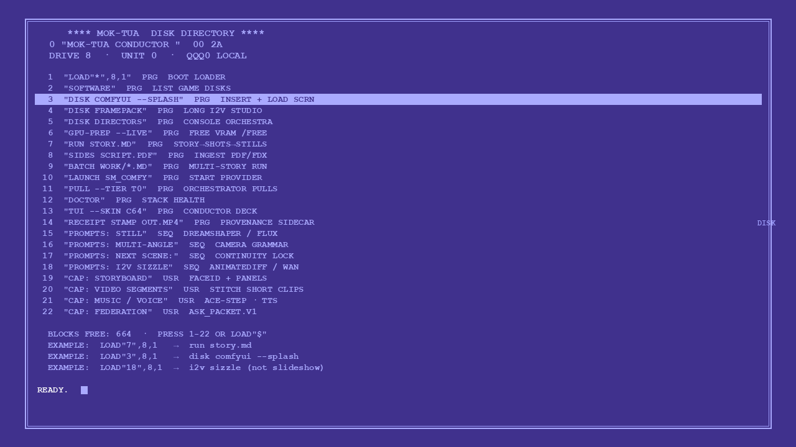
  </a>
</p>

<p align="center">
  <strong>PETSCII Matrix</strong> brand export (~28s) · loader → µ rain → CRT off → tmux → disk menu<br />
  <em>(post-FaceID)</em> packaging era · not a face demo<br />
  <a href="docs/assets/exports/mok-tua-petscii-matrix-export.mp4"><strong>▶ Press to play</strong></a>
  · <a href="docs/assets/exports/README.md">cite table</a>
  · <a href="docs/assets/exports/mok-tua-petscii-matrix-poster.png">poster</a>
</p>

# mok-tua

**Turn a script into storyboard pictures — and, when you want, short video — on machines you own.**

Local-first creative control desk for M.A.N.A.G.E.R.  
Hybrid **v0.6.0** · public · MIT · [smoke-tested capabilities](docs/reports/SMOKE_TESTED_CAPABILITIES_2026-08-07.md) · [orchestration smoke (cited)](docs/operations/ORCHESTRATION_SMOKE_CITED_2026-08-07.md)

[](CHANGELOG.md)
[](https://github.com/the1truedan/mok-tua/releases)
[](LICENSE)
[](https://linktr.ee/the1truedan)
[](https://ko-fi.com/the1truedan)

**Current release:** [`v0.6.0`](https://github.com/the1truedan/mok-tua/releases/tag/v0.6.0) — more open video models confirmed working end to end · Director's Console job submission verified · shot curation tool · lipsync integration points wired in · see [CHANGELOG](CHANGELOG.md) · [HANDOFF](HANDOFF.md)

---

## In plain English

You have a **script** (or PDF “sides”, Final Draft, or a markdown story).  
**mok-tua** breaks it into **shots**, draws **storyboard stills**, and can hand those stills to a **video** engine.

It does **not** replace every app. It is the **conductor**:

| Role | What it does for you |
|------|----------------------|
| **Conductor** | mok-tua API + CLI — plans the run, tracks shots, safety gates |
| **Writer helper** | Local LLM gateway (Headroom) — expands rough notes into shot lists |
| **Camera / paint** | [ComfyUI](https://github.com/comfyanonymous/ComfyUI) — makes the actual images (and optional video) |
| **Director UI** | [Director's Console](https://github.com/cocktailpeanut/directorsconsole.pinokio.git) — camera/lens/shot-grammar layer |
| **Video studio** | [Maestro](https://github.com/Blizaine/Maestro) — model-agnostic video front end (WAN, LTX, and friends) |
| **App installer** | [Pinokio](https://pinokio.computer) — one-click install/run for the surrounding AI app zoo |
| **Model pool** | [Stability Matrix](https://github.com/LykosAI/StabilityMatrix) — shared weights so apps don't duplicate downloads |
| **Model routing** | [LiteLLM](https://github.com/BerriAI/litellm) — one API over local + cloud LLMs, gated by privacy tier |
| **Face / body** | FaceFusion, FreeMoCap, LivePortrait, … |
| **Sound** | ACE-Step, TTS-Story, voice tools |
| **Optional cloud** | Grok Imagine / Nano Banana stills — only when you say so |

**Private / medical content never auto-uploads.** Cloud is opt-in and gated.

---

## Why this exists (personal note)

I had **Pinokio** and **Stability Matrix** on both Mac and Linux — one-click installs for ComfyUI, FaceFusion, video tools, voice tools, Director’s Console, the works. Each app was fine in isolation. What perplexed me was the next problem: **how do they all talk?**

Story in one place, stills from another, video on a GPU box, face polish in a third UI, voice somewhere else, privacy rules you cannot forget when the content is real caregiving work. Ports, model folders, “which machine is running what,” and no single shot ledger. Installers solve *presence*; they do not solve *pipeline*.

**mok-tua** is the conductor I needed for that gap — not another generative model, not a reskin of Comfy. It keeps the run ordered: shots, stages, QQQ gates, launch recipes, receipts. The tools keep their own GUIs.

The **Commodore 64** conductor skin is deliberate nostalgia. Time at the **Gateway Tech hardware museum** (and parallel **C64-themed deck work** on the broader **ai-gateway** maintenance surface) pulled me back to a fixed palette, a monospaced prompt, and a `READY.` line. So the TUI borrows that spirit while vendor apps stay modern. You can drive the same verbs from CLI, API, C64 TUI, or modern TUI — and still open Comfy or Director’s Console when you want the full internal GUI.

---

## Example · procurement vibecoding → M.A.N.A.G.E.R. (anime multi-angle)

Six-panel **multi-angle + next-scene** storyboard (anime style) from the photoceopic identity still, then a **14.20 s** panel-hold short.

<p align="center">
  <a href="docs/assets/exports/manager-pivot-procurement-to-manager-anime.mp4" title="Play 14.20s pivot short">
    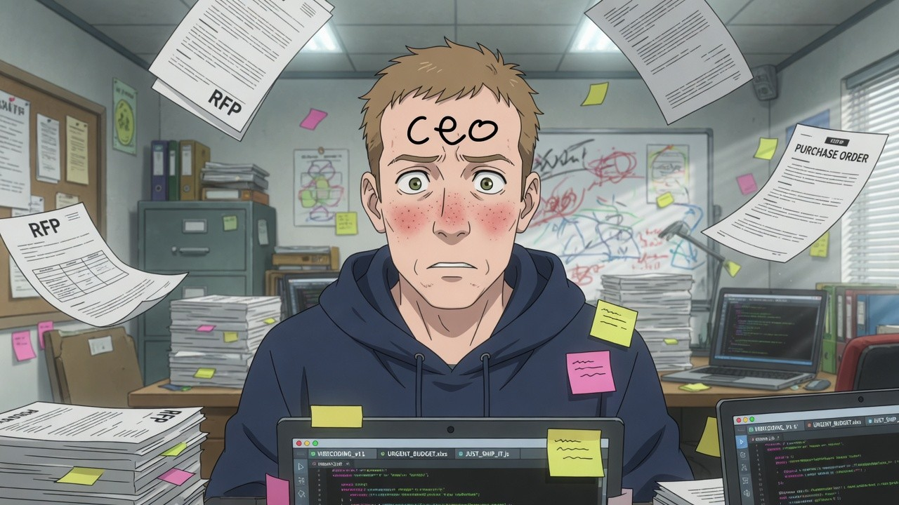
  </a>
</p>

<p align="center">
  <a href="docs/assets/exports/manager-pivot-procurement-to-manager-anime.mp4"><strong>▶ Play 14.20 s short</strong></a>
  · <a href="docs/assets/capabilities/manager-pivot/storyboard-sheet.jpg">6-panel sheet</a>
  · <a href="docs/assets/capabilities/manager-pivot/PROVENANCE.json">prompts · models · duration stats</a>
</p>

| | |
|--|--|
| **Story** | Chaotic procurement / vibecoding office → pivot → M.A.N.A.G.E.R. framework board → calm orchestrated lab |
| **Camera grammar** | Natural multi-angle phrases + `Next Scene:` continuity (same design as Qwen Edit LoRAs) |
| **Ref** | `docs/assets/pres-smoke/00-ceo-source-still.jpg` (photoceopic) |
| **Duration** | **14.20 s** · 30 fps · 6×71 frames |
| **Stills** | Imagine `image_edit` · QQQ1 demo (not medical) |
| **Local Qwen Edit 2509** | Pool staged (`local_qwen_edit` 6/6) · **OOM on 16 GB** KSampler — see provenance |

<p align="center">
  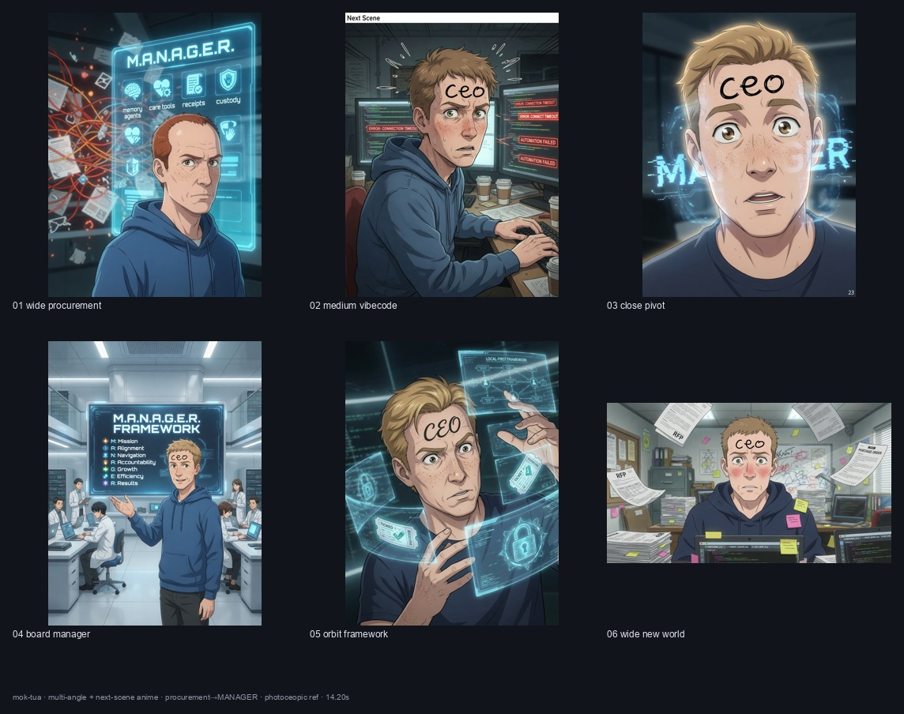
</p>

---

## What you get (pictures worth a thousand words)

<p align="center">
  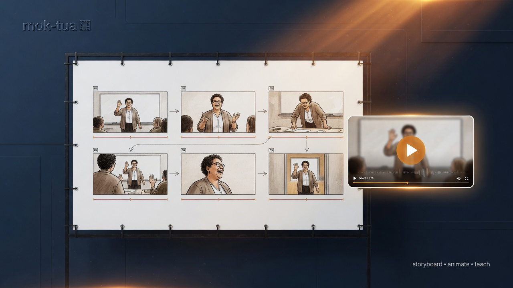
</p>

<p align="center"><em>Idea → panels → motion — CEO identity from <code>00-ceo-source-still.jpg</code> via FaceID PLUS V2 (not stock concept art). mok-tua keeps the steps ordered and auditable.</em></p>

### Prompt → product (one diagram)

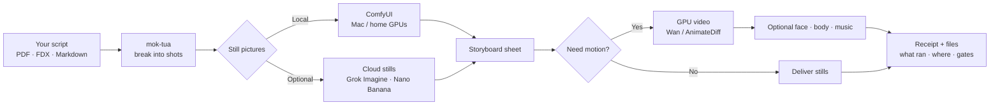
```mermaid
flowchart LR
  A[Your script<br/>PDF · FDX · Markdown] --> B[mok-tua<br/>break into shots]
  B --> C{Still pictures}
  C -->|Local| D[ComfyUI<br/>Mac / home GPUs]
  C -->|Optional| E[Cloud stills<br/>Grok Imagine · Nano Banana]
  D --> F[Storyboard sheet]
  E --> F
  F --> G{Need motion?}
  G -->|No| H[Deliver stills]
  G -->|Yes| I[GPU video<br/>Wan / AnimateDiff]
  I --> J[Optional face · body · music]
  J --> K[Receipt + files<br/>what ran · where · gates]
  H --> K
```

### Product map (lab tools)

<p align="center">
  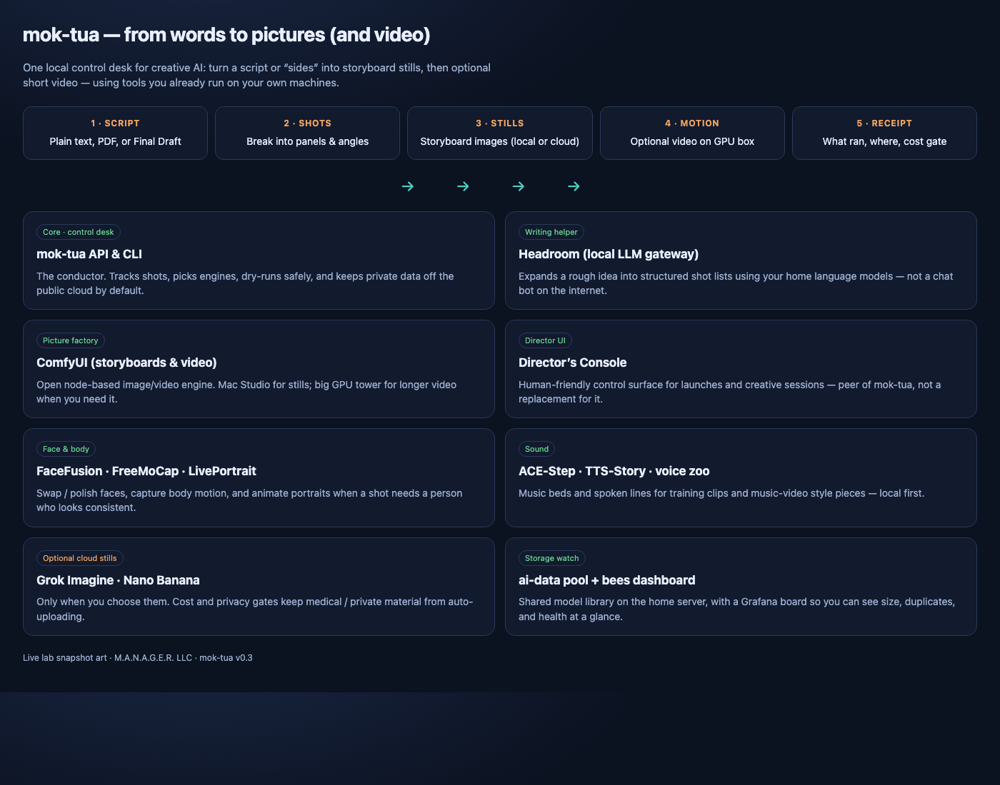
</p>

### Presentation smoke (same silly face · not full video)

Starter still = the goofy **“ceo” forehead** selfie (vulnerable, absurd, intentional).  
That identity is the only face in these mockups — COMDEX keynote, functions board, cartoon NVIDIA-booth hangout, six-panel presentation storyboard. **Mock stills only** (smoke for storyboard / I2V / director language), not a finished video.

| 0 · Source still (prompt fodder) | 1 · COMDEX keynote mock |
|----------------------------------|-------------------------|
|  | 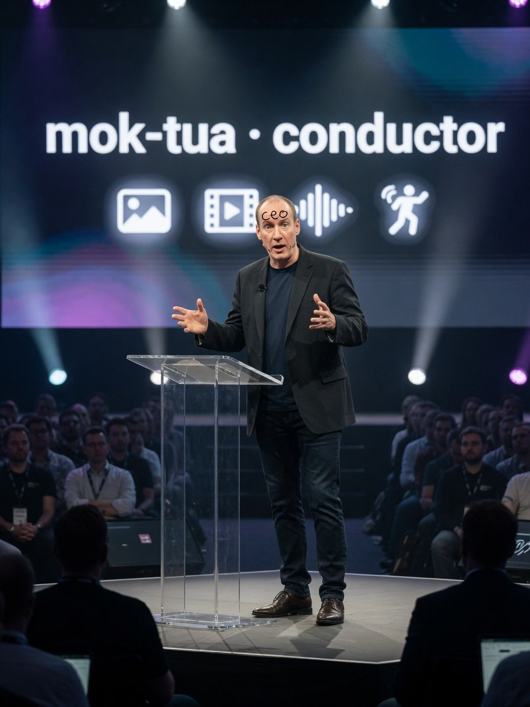 |

| 2 · Functions board demo | 3 · Cartoon hangout (blatant silly) |
|--------------------------|-------------------------------------|
| 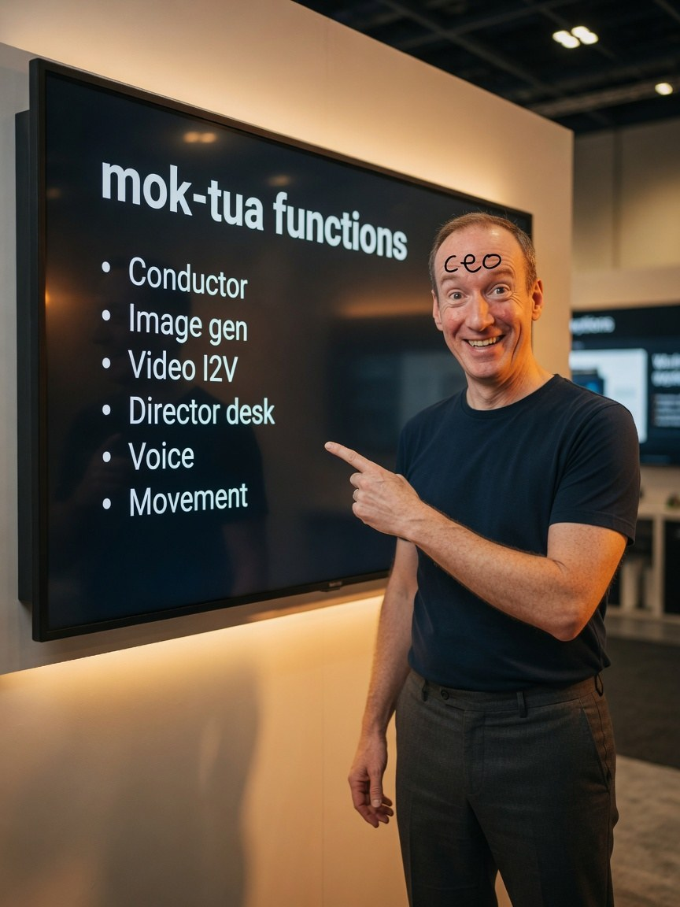 | 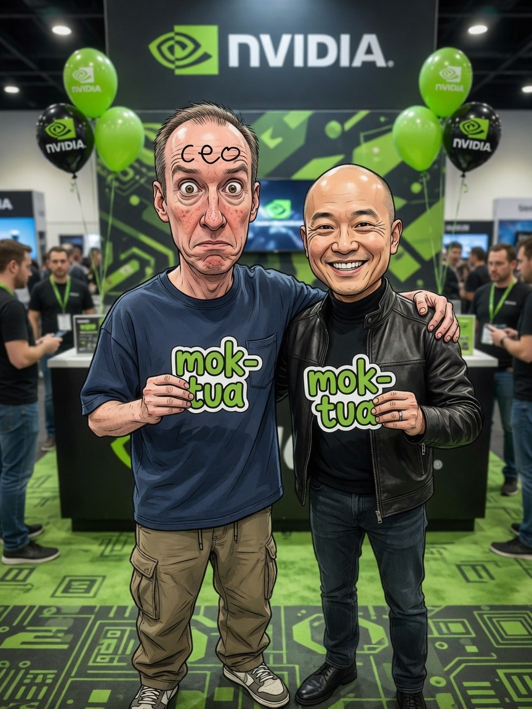 |

<p align="center">
  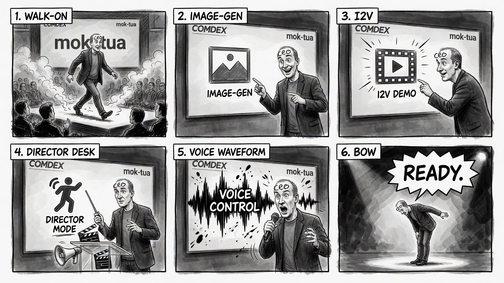
</p>

<p align="center"><em>Walk-on → image gen → I2V → director desk → voice → READY. — presentation smoke storyboard from the same face.</em></p>

Folder: [`docs/assets/pres-smoke/`](docs/assets/pres-smoke/) · reuse `00-ceo-source-still.jpg` as LoadImage for live Comfy/Wan experiments.

### CMIP origin storyboard (FaceID · local Comfy · **not Imagine**)

Eight-panel comic of how [cmip-terpene-db](https://github.com/the1truedan/cmip-terpene-db) came to be — vibecode → look up terpenes → collect → stoners gather → verify → toss unverified data → stoners stay → coder still codes. Identity from `pres-smoke/00-ceo-source-still.jpg` via **FaceID PLUS V2**.

<p align="center">
  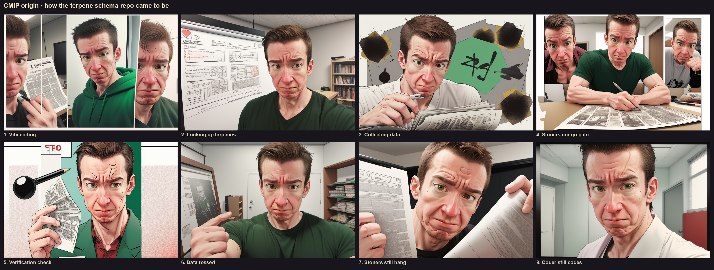
</p>

<p align="center">
  <a href="docs/assets/cmip-terpene-origin/">panels</a>
  · <a href="docs/assets/receipts/cmip-terpene-origin-storyboard.receipt.json">receipt</a>
  · <a href="scripts/regen_cmip_terpene_storyboard.py"><code>regen_cmip_terpene_storyboard.py</code></a>
  · <a href="docs/operations/ORCHESTRATION_SMOKE_CITED_2026-08-07.md">orchestration smoke</a>
</p>

### Other illustrative outputs (GPU-host · CEO identity · **post-FaceID** · v0.5.7+)

Regenerated on **gpu-host Comfy** from `pres-smoke/00-ceo-source-still.jpg` via **IPAdapter FaceID PLUS V2** (padded face ref for InsightFace).  
**Cite as (post-FaceID).** Older Ken Burns / hybrid Grok clips are **(pre-FaceID)** — see [`docs/assets/exports/README.md`](docs/assets/exports/README.md).  
Individual panels: [`docs/assets/capabilities/panels/`](docs/assets/capabilities/panels/) · Receipts: [`docs/assets/receipts/`](docs/assets/receipts/) · script: `scripts/regen_ceo_capability_assets.py`.

| Storyboard sheet (FaceID PLUS V2) | Face polish BEFORE / AFTER (gentle refine) |
|-----------------------------------|--------------------------------------------|
| 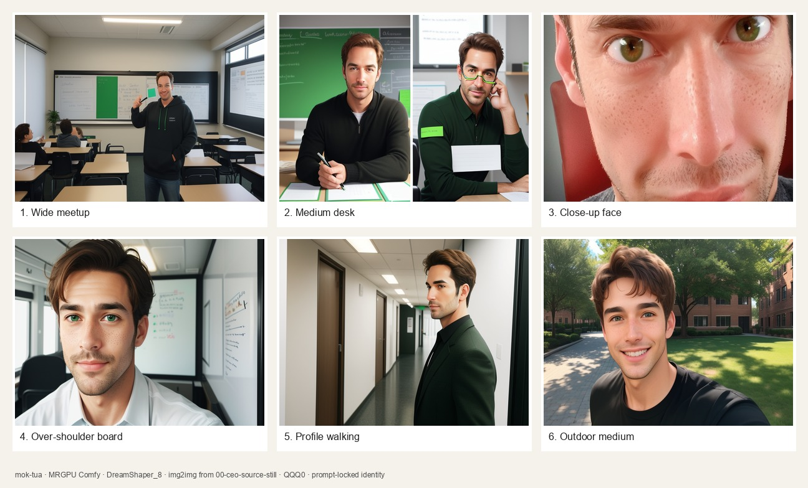 | 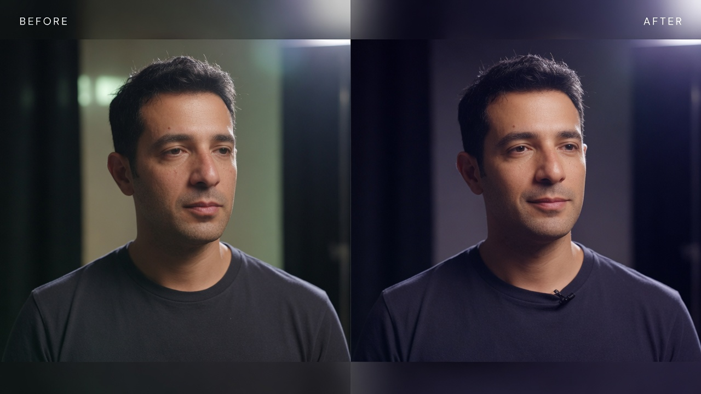 |

| Short-loop strip (glitch-filtered · not Grok) | Conductor TUI (fixed PETSCII boot) |
|-----------------------------------------------|------------------------------------|
| 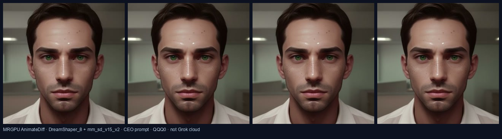 | 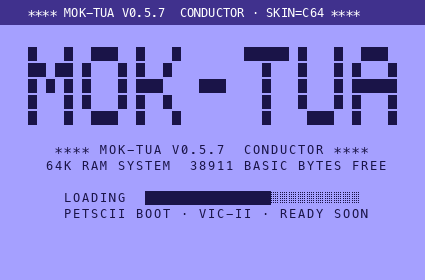 |

<p align="center"><em>path · prompt · renderer · host_role · QQQ0 on each card — never claim cloud I2V as local GPU.</em></p>

---

## Products you can use (short tour)

| Product | Plain job | Where it lives |
|---------|-----------|----------------|
| **mok-tua** | Conductor: script → shots → stills → video plan | This repo · API `:8799` |
| **ComfyUI** | Draws images / video from node graphs | Mac Studio stills · GPU tower video |
| **Director’s Console** | Friendly UI for launches & creative sessions | Peer app (Pinokio stack) |
| **Headroom** | Local “smart notes → shot list” via your LLMs | Gateway `:8787` |
| **Wan / FramePack** | Image → short video clips | GPU worker |
| **FaceFusion / LivePortrait** | Consistent faces & talking heads | Face tier tools |
| **FreeMoCap** | Body motion capture | Body tier tools |
| **ACE-Step / TTS-Story** | Music beds & spoken lines | Audio tier tools |
| **Grok Imagine / Nano Banana** | Optional paid/cloud stills | Only with keys + privacy gate |

### Capability cards (split · v0.5.7) — not one tall PNG

**One image per component** under [`docs/assets/product-capabilities/`](docs/assets/product-capabilities/) so GitHub doesn’t pull a multi‑MB vertical hog.  
Each card embeds **path · prompt/command · tool** under the photo (sausage-made).

<p align="center">
  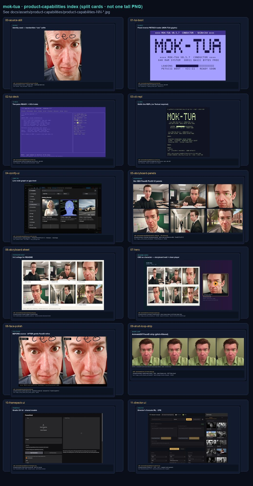
</p>

| # | Card file | Component |
|---|-----------|-----------|
| 00 | [`product-capabilities-00-source-still.jpg`](docs/assets/product-capabilities/product-capabilities-00-source-still.jpg) | Source selfie |
| 01 | [`product-capabilities-01-tui-boot.jpg`](docs/assets/product-capabilities/product-capabilities-01-tui-boot.jpg) | PETSCII TUI boot |
| 02 | [`product-capabilities-02-tui-deck.jpg`](docs/assets/product-capabilities/product-capabilities-02-tui-deck.jpg) | Two-pane deck |
| 03 | [`product-capabilities-03-cli-repl.jpg`](docs/assets/product-capabilities/product-capabilities-03-cli-repl.jpg) | CLI REPL |
| 04 | [`product-capabilities-04-comfy-ui.jpg`](docs/assets/product-capabilities/product-capabilities-04-comfy-ui.jpg) | ComfyUI IRL |
| 05 | [`product-capabilities-05-storyboard-panels.jpg`](docs/assets/product-capabilities/product-capabilities-05-storyboard-panels.jpg) | Six FaceID panels |
| 06 | [`product-capabilities-06-storyboard-sheet.jpg`](docs/assets/product-capabilities/product-capabilities-06-storyboard-sheet.jpg) | Storyboard sheet |
| 07 | [`product-capabilities-07-hero.jpg`](docs/assets/product-capabilities/product-capabilities-07-hero.jpg) | README hero |
| 08 | [`product-capabilities-08-face-polish.jpg`](docs/assets/product-capabilities/product-capabilities-08-face-polish.jpg) | Face polish B/A |
| 09 | [`product-capabilities-09-short-loop-strip.jpg`](docs/assets/product-capabilities/product-capabilities-09-short-loop-strip.jpg) | AD strip (glitch-filtered) |
| 10 | [`product-capabilities-10-framepack-ui.jpg`](docs/assets/product-capabilities/product-capabilities-10-framepack-ui.jpg) | FramePack Gradio |
| 11 | [`product-capabilities-11-director-ui.jpg`](docs/assets/product-capabilities/product-capabilities-11-director-ui.jpg) | Director UI |

Legacy raw URL [`products-capabilities.png`](docs/assets/products-capabilities.png) is now a **small index** (same path, bandwidth-friendly), not a 10k-tall poster.

Smoke matrix: [`docs/reports/SMOKE_TESTED_CAPABILITIES_2026-08-05.md`](docs/reports/SMOKE_TESTED_CAPABILITIES_2026-08-05.md) · stamp [`capability_stamp_0.5.7.json`](docs/reports/capability_stamp_0.5.7.json).

---

## Integrated stack (real vendor UIs + polished mok-ups)

We **do not invent** ComfyUI / Director’s Console / LiteLLM. Those products already have standard interfaces — we **showcase them**, then show how mok-tua sits beside them as conductor (API · CLI · optional TUI).

**No lab dumps:** no home paths, LAN IPs, or raw `/healthz` JSON.

### Picture factory — ComfyUI (proper GUI)

<p align="center">
  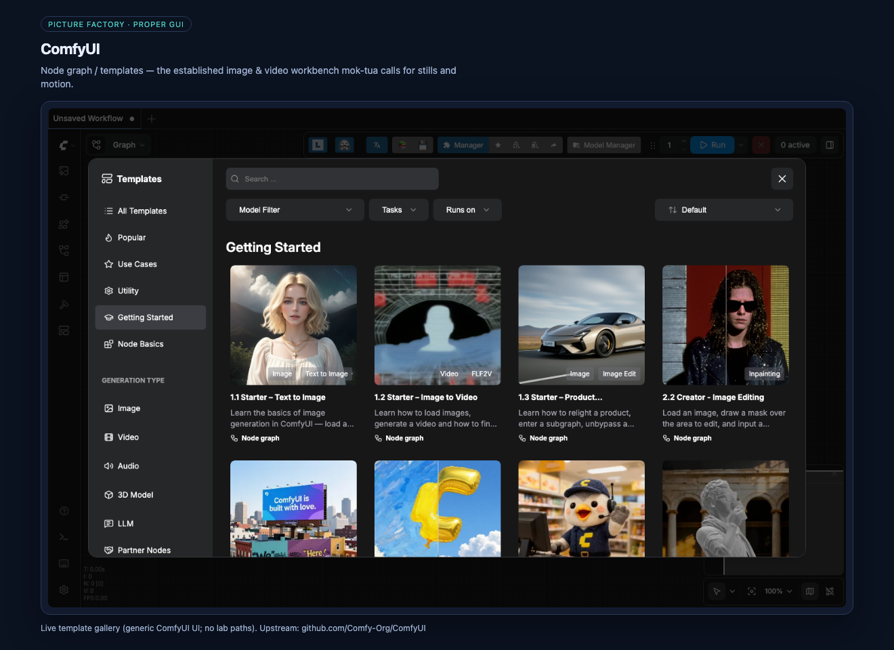
</p>

### Director’s desk — official sample ([NickPittas/DirectorsConsole](https://github.com/NickPittas/DirectorsConsole))

| Storyboard canvas | CPE film presets |
|-------------------|------------------|
| 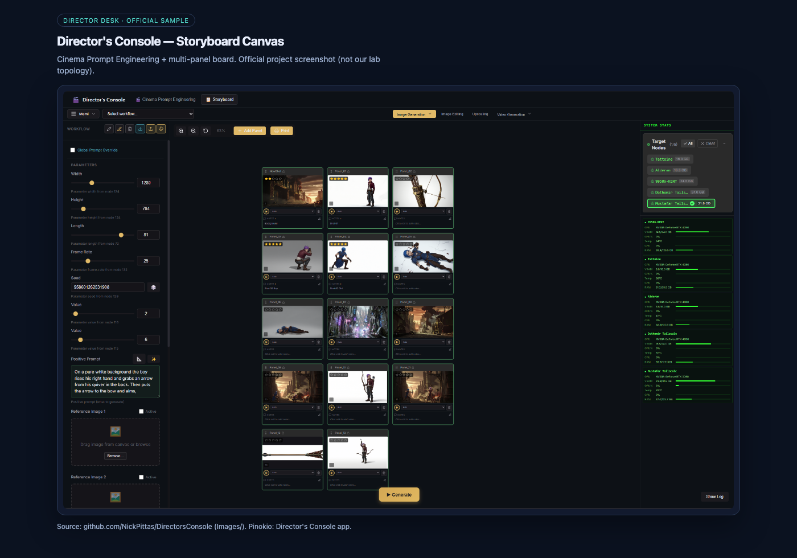 | 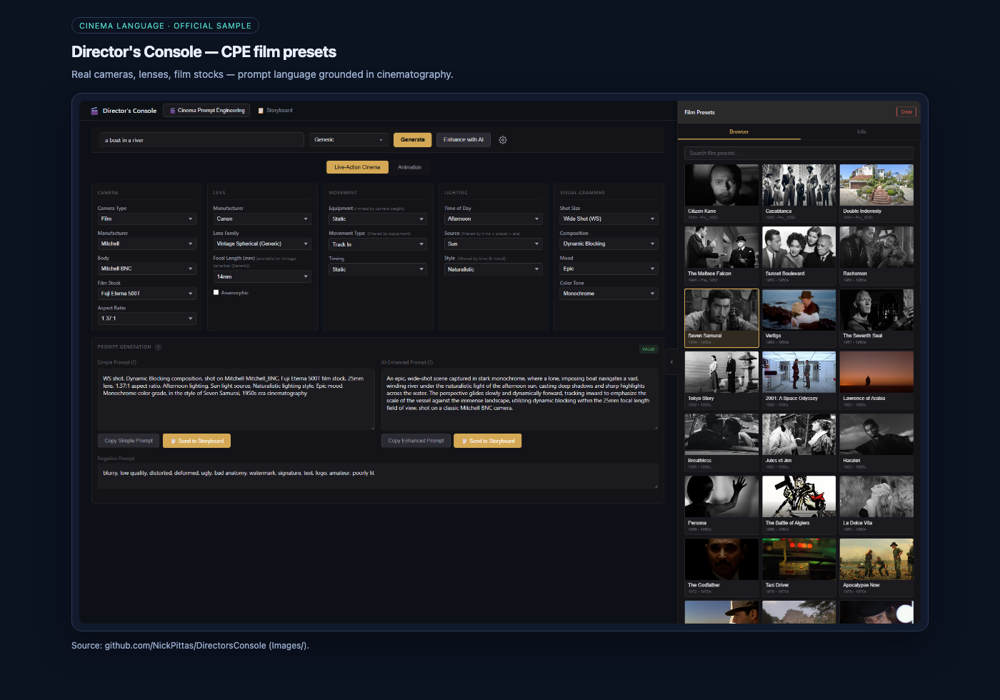 |

Also installable via **Pinokio** (“Director’s Console”).

### LiteLLM routing (gateway example · no secrets)

<p align="center">
  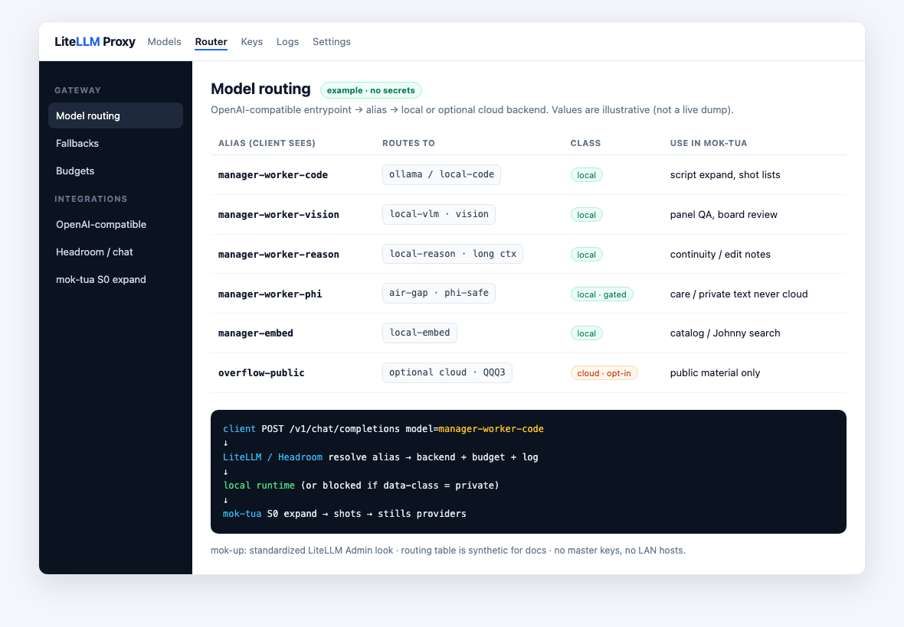
</p>

OpenAI-compatible aliases → local (or opt-in cloud) backends → mok-tua S0 expand.  
Upstream Admin chrome sample (for look only): `docs/assets/mokup-litellm-admin-sample.png`.

### Conductor TUI — Commodore 64 skin + modern option

**Shipped.** Vendor tools keep their modern GUIs; mok-tua’s **conductor** exposes a **PETSCII-style TUI** (C64 palette, line-oriented prompt) or a modern navy Textual skin. Same verbs as the CLI (`doctor`, `providers`, `run`, `smoke`, `lock`, …) via a thin bridge — no second business-logic path.

```bash
# default C64 skin (Textual if installed, else stdlib REPL)
python3 scripts/mok_tua_cli.py tui
# or
./scripts/run_tui.sh
./scripts/run_tui.sh --skin modern
python3 -m tui --skin c64 --repl   # line-only, no Textual
# full-screen: pip install -r tui/requirements.txt
```

In the TUI: **D** doctor · **P** providers · **R** run · **S** smoke · **L** lock · **H** help · **Q** quit.

<p align="center">
  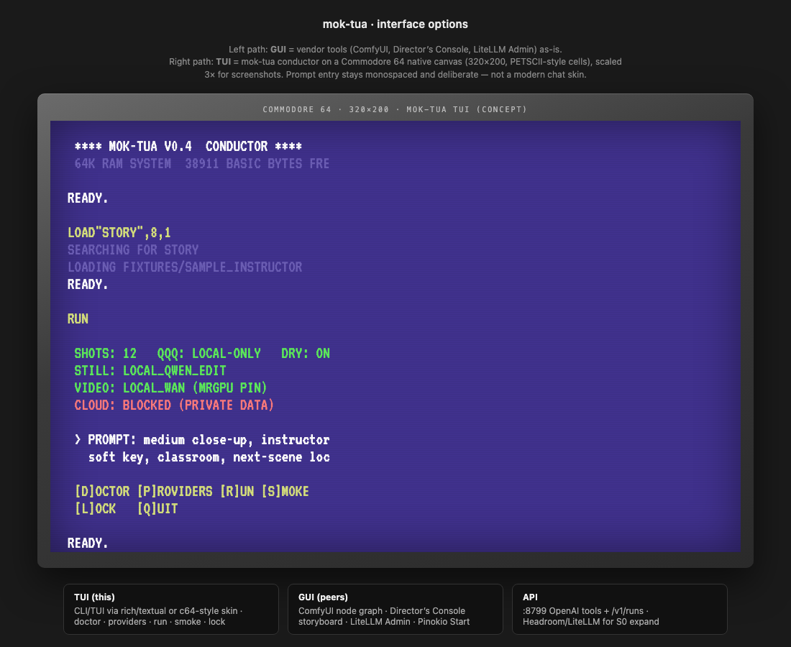
</p>

Full interface design + integration rules: **[`docs/INTERFACES.md`](docs/INTERFACES.md)**  
Asset credits: [`docs/ASSETS.md`](docs/ASSETS.md).

---

## Core code — what each folder is for

| Folder / file | In human terms |
|---------------|----------------|
| `api/` | The web service: parse story, run stages, talk to Comfy / Headroom / cloud stubs |
| `api/story_parse.py` | Turns markdown story into shot objects |
| `api/stages.py` | The pipeline steps (expand → stills → video → resume) |
| `api/prompt_build.py` | Camera angles & “next scene” wording for picture prompts |
| `api/providers.py` | Menu of engines (local stills, cloud stills, video backends) |
| `api/sides_ingest.py` | PDF / Final Draft / plain text → story markdown |
| `api/ask_packet.py` | Sealed “please render this” jobs for a trusted lab (not a public marketplace) |
| `scripts/mok_tua_cli.py` | One CLI for doctor, launch, pull, smoke, lock, packet, **tui** |
| `tui/` | Conductor TUI (C64 / modern skins) over CLI verbs |
| `scripts/run_tui.sh` | Launcher for the TUI |
| `config/` | Pins, pricing gates, camera library, director-stack catalog |
| `workflows/` | Comfy graph pins (storyboard / video recipes) |
| `schemas/` | JSON shapes for packets & receipts |
| `fixtures/` | Sample instructor story & sides for demos |
| `docs/` | Human guide, operator guide, federation & Comfy notes |
| `tests/` | Automated checks for packets / TUI bridge / core behavior |

You do **not** need to read every file to use it. Start with: script in → dry-run → stills when Comfy is up.

---

## 60-second try (safe dry-run)

```bash
cd ~/mok-tua
chmod +x scripts/*.sh scripts/mok_tua_cli.py
./scripts/run_host.sh          # starts API on :8799

# other terminal — no spend, no cloud:
python3 scripts/mok_tua_cli.py doctor
python3 scripts/mok_tua_cli.py batch fixtures/sample_instructor_story.md
curl -s http://127.0.0.1:8799/healthz
```

When Comfy is running and models are staged:

```bash
python3 scripts/mok_tua_cli.py run fixtures/sample_instructor_story.md --live-still --no-dry-run
```

---

## Privacy & cost modes (QQQ — simple view)

| Mode | Meaning |
|------|---------|
| **Local only** | Stay on your machines (default for sensitive work) |
| **Free / public overflow** | Limited free remote help for **public** material only |
| **Paid cloud** | Grok Imagine, etc. — needs keys + explicit non-private confirm |

Medical / caregiver private data is never auto-sent to cloud.

---

## For operators & power users

Deep CLI, tier locks (T0–T4), pull hygiene, ask-packet federation, ROBUST Comfy install, Docker, and API tables live here:

- **[docs/OPERATORS.md](docs/OPERATORS.md)** — full technical runbook (former dense README body)
- [docs/ASK_PACKET_FEDERATION.md](docs/ASK_PACKET_FEDERATION.md) — sealed lab jobs + receipts  
- [docs/COMFY_ROBUST_NODES.md](docs/COMFY_ROBUST_NODES.md) — GPU worker node roster  
- [config/director_stack_catalog.md](config/director_stack_catalog.md) — map of installed creative tools  

---

## Version notes

| Ver | What changed (human) |
|-----|----------------------|
| **0.6.0** | More open video models confirmed working end to end on a 16 GB GPU (MiniMax H3, LTX-2.3); Director's Console job submission verified end to end; `curate` tool for picking best takes across runs; lipsync tool integration points wired in — no demo video yet |
| **0.5.10** | PETSCII Matrix brand short v4 (~28s: loader→µ→CRT→tmux→disk menu); TUI launch workflow (intro→help→status→deck); `show`/`play`/`open` jpg·png·mp4; `menu`/`media` verbs |
| **0.5.9** | C64 software catalog · disk insert · gpu-prep · AnimateDiff motion sizzle; Qwen sampling paused on 16 GB |
| **0.5.8** | Manager pivot anime multi-angle storyboard · 14.20 s panel-hold export · Qwen Edit weights staged |
| **0.5.7** | Transparency capability poster · IPAdapter plus-face panels · fixed PETSCII boot · IRL UIs |
| **0.5.3** | Presentation smoke: CEO still → COMDEX keynote, functions board, cartoon hangout, storyboard sheet |
| **0.5.2** | Collage: distinct complex image vs Wan I2V graphs, Drive source still, full uncropped layout |
| **0.5.1** | Annotated capability collage + personal origin (Pinokio/SM gap, Gateway Tech C64 nostalgia, ai-gateway deck) |
| **0.5** | Conductor TUI shipped (`tui/`): C64 + modern skins, CLI `tui` verb, vendor GUI mok-ups kept |
| **0.4** | Clearer public story + product map + non-doxxing vendor/mok-up art |
| **0.3** | Tier lock, GPU-host monitor, ask-packets, ROBUST Comfy roster |
| **0.2** | Providers, sides ingest, multi-angle stills, CLI launch/pull |
| **0.1** | First scaffold |

See **[CHANGELOG.md](CHANGELOG.md)** for dated detail · GitHub release **[v0.6.0](https://github.com/the1truedan/mok-tua/releases/tag/v0.6.0)**.

---

## License

MIT — see [LICENSE](LICENSE).

Built for **M.A.N.A.G.E.R. LLC** — local-first, auditable, sovereign creative tooling.
