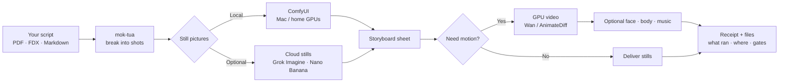
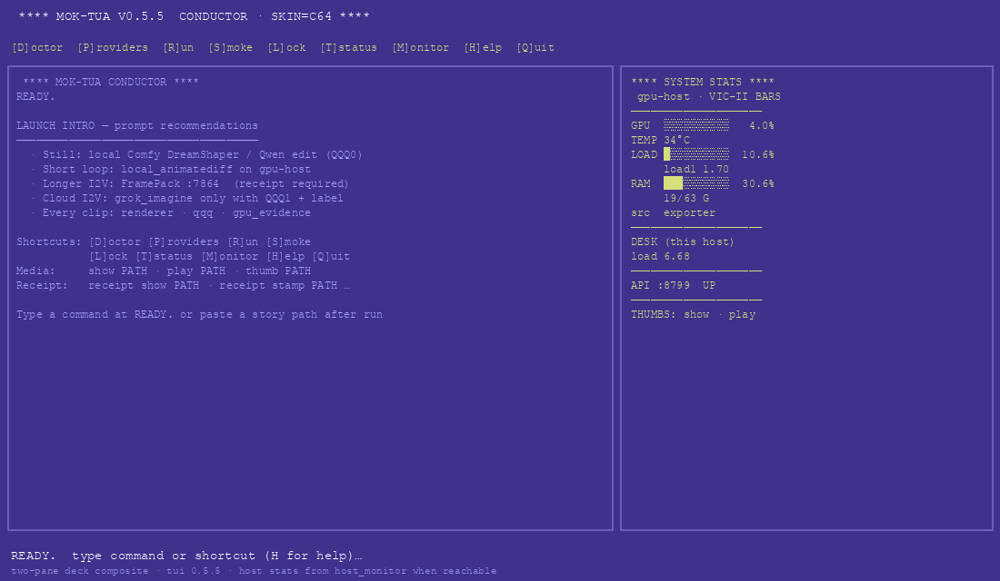
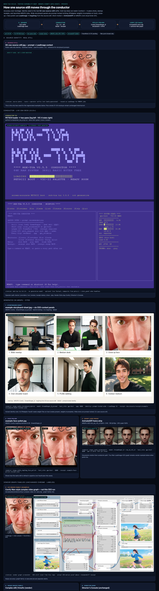

# mok-tua

**Turn a script into storyboard pictures — and, when you want, short video — on machines you own.**

Local-first creative control desk for M.A.N.A.G.E.R.  
Hybrid **v0.5.6** · private GitHub · MIT · [smoke-tested capabilities](docs/reports/SMOKE_TESTED_CAPABILITIES_2026-08-05.md)

[](https://linktr.ee/the1truedan)
[](https://ko-fi.com/the1truedan)

---

## In plain English

You have a **script** (or PDF “sides”, Final Draft, or a markdown story).  
**mok-tua** breaks it into **shots**, draws **storyboard stills**, and can hand those stills to a **video** engine.

It does **not** replace every app. It is the **conductor**:

| Role | What it does for you |
|------|----------------------|
| **Conductor** | mok-tua API + CLI — plans the run, tracks shots, safety gates |
| **Writer helper** | Local LLM gateway (Headroom) — expands rough notes into shot lists |
| **Camera / paint** | ComfyUI — makes the actual images (and optional video) |
| **Director UI** | Director’s Console — human-friendly control surface |
| **Face / body** | FaceFusion, FreeMoCap, LivePortrait, … |
| **Sound** | ACE-Step, TTS-Story, voice tools |
| **Optional cloud** | Grok Imagine / Nano Banana stills — only when you say so |

**Private / medical content never auto-uploads.** Cloud is opt-in and gated.

---

## Why this exists (personal note)

I had **Pinokio** and **Stability Matrix** on both Mac and Linux — one-click installs for ComfyUI, FaceFusion, video tools, voice tools, Director’s Console, the works. Each app was fine in isolation. What perplexed me was the next problem: **how do they all talk?**

Story in one place, stills from another, video on a GPU box, face polish in a third UI, voice somewhere else, privacy rules you cannot forget when the content is real caregiving work. Ports, model folders, “which machine is running what,” and no single shot ledger. Installers solve *presence*; they do not solve *pipeline*.

**mok-tua** is the conductor I needed for that gap — not another generative model, not a reskin of Comfy. It keeps the run ordered: shots, stages, QQQ gates, launch recipes, receipts. The tools keep their own GUIs.

The **Commodore 64** conductor skin is deliberate nostalgia. Time at the **Gateway Tech hardware museum** (and parallel **C64-themed deck work** on the broader **ai-gateway** maintenance surface) pulled me back to a fixed palette, a monospaced prompt, and a `READY.` line. So the TUI borrows that spirit while vendor apps stay modern. You can drive the same verbs from CLI, API, C64 TUI, or modern TUI — and still open Comfy or Director’s Console when you want the full internal GUI.

---

## What you get (pictures worth a thousand words)

<p align="center">
  
</p>

<p align="center"><em>Idea → panels → motion. mok-tua keeps the steps ordered and auditable.</em></p>

### Prompt → product (one diagram)



### Product map (lab tools)

<p align="center">
  
</p>

### Presentation smoke (same silly face · not full video)

Starter still = the goofy **“ceo” forehead** selfie (vulnerable, absurd, intentional).  
That identity is the only face in these mockups — COMDEX keynote, functions board, cartoon NVIDIA-booth hangout, six-panel presentation storyboard. **Mock stills only** (smoke for storyboard / I2V / director language), not a finished video.

| 0 · Source still (prompt fodder) | 1 · COMDEX keynote mock |
|----------------------------------|-------------------------|
|  |  |

| 2 · Functions board demo | 3 · Cartoon hangout (blatant silly) |
|--------------------------|-------------------------------------|
|  |  |

<p align="center">
  
</p>

<p align="center"><em>Walk-on → image gen → I2V → director desk → voice → READY. — presentation smoke storyboard from the same face.</em></p>

Folder: [`docs/assets/pres-smoke/`](docs/assets/pres-smoke/) · reuse `00-ceo-source-still.jpg` as LoadImage for live Comfy/Wan experiments.

### Other illustrative outputs (MRGPU · CEO identity · cited)

Regenerated on **gpu-host Comfy** from `pres-smoke/00-ceo-source-still.jpg` (2026-08-05).  
Receipts: [`docs/assets/receipts/`](docs/assets/receipts/).

| Storyboard (hybrid DreamShaper_8) | Face polish (img2img denoise≈0.28) |
|-----------------------------------|--------------------------------------|
|  |  |

| AnimateDiff short-loop strip (not cloud Grok) | Conductor TUI (PETSCII boot → two-pane) |
|-----------------------------------------------|----------------------------------------|
|  |  |

<p align="center"><em>renderer · model · host_role · QQQ0 · gpu_evidence on each receipt — never claim cloud I2V as local GPU.</em></p>

---

## Products you can use (short tour)

| Product | Plain job | Where it lives |
|---------|-----------|----------------|
| **mok-tua** | Conductor: script → shots → stills → video plan | This repo · API `:8799` |
| **ComfyUI** | Draws images / video from node graphs | Mac Studio stills · GPU tower video |
| **Director’s Console** | Friendly UI for launches & creative sessions | Peer app (Pinokio stack) |
| **Headroom** | Local “smart notes → shot list” via your LLMs | Gateway `:8787` |
| **Wan / FramePack** | Image → short video clips | GPU worker |
| **FaceFusion / LivePortrait** | Consistent faces & talking heads | Face tier tools |
| **FreeMoCap** | Body motion capture | Body tier tools |
| **ACE-Step / TTS-Story** | Music beds & spoken lines | Audio tier tools |
| **Grok Imagine / Nano Banana** | Optional paid/cloud stills | Only with keys + privacy gate |

### Capability collage (accurate workflow · v0.5.6)

**One CEO source still** → conductor TUI → MRGPU storyboard / face polish / AnimateDiff loop · vendor graphs labeled as *family examples* when not this run.

<p align="center">
  
</p>

| # | Capability | What you see | Tool surface / citation |
|---|------------|--------------|-------------------------|
| 0 | **Source still** | Real `00-ceo-source-still.jpg` (not a crop montage) | LoadImage / prompt context |
| — | **Conductor** | PETSCII boot → two-pane VIC-II stats | `tui --skin c64` · CLI · API `:8799` |
| 1 | **Storyboard** | Regenerated CEO six-panel sheet | MRGPU Comfy DreamShaper_8 · receipt |
| 2 | **Face polish** | BEFORE source · AFTER img2img refine | MRGPU Comfy · receipt |
| 3 | **Short loop** | AnimateDiff frame strip (GPU 100%) | MRGPU ADE + VHS · not Grok cloud |
| 4 | **I2V graph family** | Wan-style complex graph (vendor example) | Labeled *not this CEO run* |
| 5 | **Still graph family** | Hiresfix complex graph (vendor) | Example only |
| 6 | **Director desk** | Director’s Console chrome | Peer GUI + mok-tua ledger |

Source HTML: [`docs/assets/mokups/capability-collage.html`](docs/assets/mokups/capability-collage.html).  
Smoke matrix: [`docs/reports/SMOKE_TESTED_CAPABILITIES_2026-08-05.md`](docs/reports/SMOKE_TESTED_CAPABILITIES_2026-08-05.md).

---

## Integrated stack (real vendor UIs + polished mok-ups)

We **do not invent** ComfyUI / Director’s Console / LiteLLM. Those products already have standard interfaces — we **showcase them**, then show how mok-tua sits beside them as conductor (API · CLI · optional TUI).

**No lab dumps:** no home paths, LAN IPs, or raw `/healthz` JSON.

### Picture factory — ComfyUI (proper GUI)

<p align="center">
  
</p>

### Director’s desk — official sample ([NickPittas/DirectorsConsole](https://github.com/NickPittas/DirectorsConsole))

| Storyboard canvas | CPE film presets |
|-------------------|------------------|
|  |  |

Also installable via **Pinokio** (“Director’s Console”).

### LiteLLM routing (gateway example · no secrets)

<p align="center">
  
</p>

OpenAI-compatible aliases → local (or opt-in cloud) backends → mok-tua S0 expand.  
Upstream Admin chrome sample (for look only): `docs/assets/mokup-litellm-admin-sample.png`.

### Conductor TUI — Commodore 64 skin + modern option

**Shipped.** Vendor tools keep their modern GUIs; mok-tua’s **conductor** exposes a **PETSCII-style TUI** (C64 palette, line-oriented prompt) or a modern navy Textual skin. Same verbs as the CLI (`doctor`, `providers`, `run`, `smoke`, `lock`, …) via a thin bridge — no second business-logic path.

```bash
# default C64 skin (Textual if installed, else stdlib REPL)
python3 scripts/mok_tua_cli.py tui
# or
./scripts/run_tui.sh
./scripts/run_tui.sh --skin modern
python3 -m tui --skin c64 --repl   # line-only, no Textual
# full-screen: pip install -r tui/requirements.txt
```

In the TUI: **D** doctor · **P** providers · **R** run · **S** smoke · **L** lock · **H** help · **Q** quit.

<p align="center">
  
</p>

Full interface design + integration rules: **[`docs/INTERFACES.md`](docs/INTERFACES.md)**  
Asset credits: [`docs/ASSETS.md`](docs/ASSETS.md).

---

## Core code — what each folder is for

| Folder / file | In human terms |
|---------------|----------------|
| `api/` | The web service: parse story, run stages, talk to Comfy / Headroom / cloud stubs |
| `api/story_parse.py` | Turns markdown story into shot objects |
| `api/stages.py` | The pipeline steps (expand → stills → video → resume) |
| `api/prompt_build.py` | Camera angles & “next scene” wording for picture prompts |
| `api/providers.py` | Menu of engines (local stills, cloud stills, video backends) |
| `api/sides_ingest.py` | PDF / Final Draft / plain text → story markdown |
| `api/ask_packet.py` | Sealed “please render this” jobs for a trusted lab (not a public marketplace) |
| `scripts/mok_tua_cli.py` | One CLI for doctor, launch, pull, smoke, lock, packet, **tui** |
| `tui/` | Conductor TUI (C64 / modern skins) over CLI verbs |
| `scripts/run_tui.sh` | Launcher for the TUI |
| `config/` | Pins, pricing gates, camera library, director-stack catalog |
| `workflows/` | Comfy graph pins (storyboard / video recipes) |
| `schemas/` | JSON shapes for packets & receipts |
| `fixtures/` | Sample instructor story & sides for demos |
| `docs/` | Human guide, operator guide, federation & Comfy notes |
| `tests/` | Automated checks for packets / TUI bridge / core behavior |

You do **not** need to read every file to use it. Start with: script in → dry-run → stills when Comfy is up.

---

## 60-second try (safe dry-run)

```bash
cd ~/mok-tua
chmod +x scripts/*.sh scripts/mok_tua_cli.py
./scripts/run_host.sh          # starts API on :8799

# other terminal — no spend, no cloud:
python3 scripts/mok_tua_cli.py doctor
python3 scripts/mok_tua_cli.py batch fixtures/sample_instructor_story.md
curl -s http://127.0.0.1:8799/healthz
```

When Comfy is running and models are staged:

```bash
python3 scripts/mok_tua_cli.py run fixtures/sample_instructor_story.md --live-still --no-dry-run
```

---

## Privacy & cost modes (QQQ — simple view)

| Mode | Meaning |
|------|---------|
| **Local only** | Stay on your machines (default for sensitive work) |
| **Free / public overflow** | Limited free remote help for **public** material only |
| **Paid cloud** | Grok Imagine, etc. — needs keys + explicit non-private confirm |

Medical / caregiver private data is never auto-sent to cloud.

---

## For operators & power users

Deep CLI, tier locks (T0–T4), pull hygiene, ask-packet federation, ROBUST Comfy install, Docker, and API tables live here:

- **[docs/OPERATORS.md](docs/OPERATORS.md)** — full technical runbook (former dense README body)
- [docs/ASK_PACKET_FEDERATION.md](docs/ASK_PACKET_FEDERATION.md) — sealed lab jobs + receipts  
- [docs/COMFY_ROBUST_NODES.md](docs/COMFY_ROBUST_NODES.md) — GPU worker node roster  
- [config/director_stack_catalog.md](config/director_stack_catalog.md) — map of installed creative tools  

---

## Version notes

| Ver | What changed (human) |
|-----|----------------------|
| **0.5.3** | Presentation smoke: CEO still → COMDEX keynote, functions board, cartoon hangout, storyboard sheet |
| **0.5.2** | Collage: distinct complex image vs Wan I2V graphs, Drive source still, full uncropped layout |
| **0.5.1** | Annotated capability collage + personal origin (Pinokio/SM gap, Gateway Tech C64 nostalgia, ai-gateway deck) |
| **0.5** | Conductor TUI shipped (`tui/`): C64 + modern skins, CLI `tui` verb, vendor GUI mok-ups kept |
| **0.4** | Clearer public story + product map + non-doxxing vendor/mok-up art |
| **0.3** | Tier lock, MRGPU monitor, ask-packets, ROBUST Comfy roster |
| **0.2** | Providers, sides ingest, multi-angle stills, CLI launch/pull |
| **0.1** | First scaffold |

See **[CHANGELOG.md](CHANGELOG.md)** for dated detail.

---

## License

MIT — see [LICENSE](LICENSE).

Built for **M.A.N.A.G.E.R. LLC** — local-first, auditable, sovereign creative tooling.
