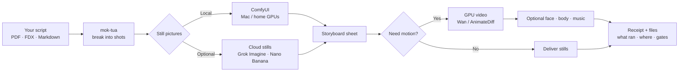
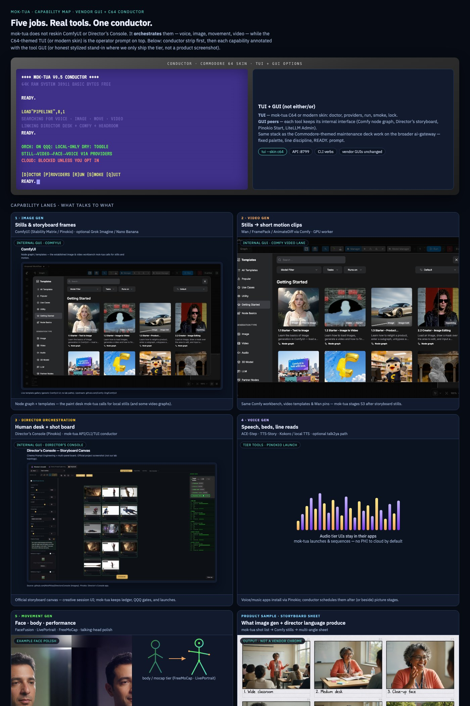
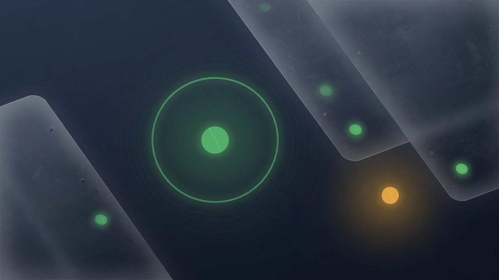
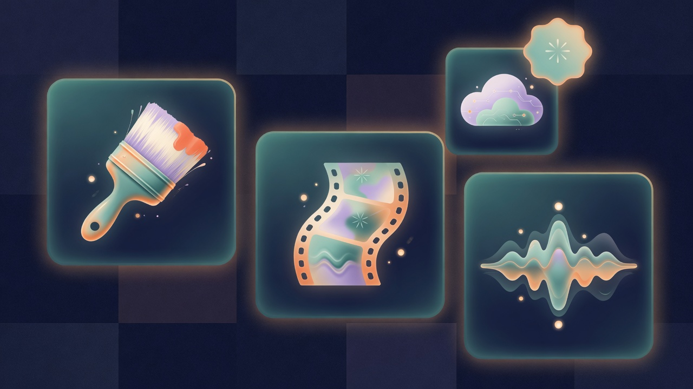

# mok-tua

**Turn a script into storyboard pictures — and, when you want, short video — on machines you own.**

Local-first creative control desk for M.A.N.A.G.E.R.  
Hybrid **v0.4** · private GitHub · MIT

[](https://linktr.ee/the1truedan)
[](https://ko-fi.com/the1truedan)

---

## In plain English

You have a **script** (or PDF “sides”, Final Draft, or a markdown story).  
**mok-tua** breaks it into **shots**, draws **storyboard stills**, and can hand those stills to a **video** engine.

It does **not** replace every app. It is the **conductor**:

| Role | What it does for you |
|------|----------------------|
| **Conductor** | mok-tua API + CLI — plans the run, tracks shots, safety gates |
| **Writer helper** | Local LLM gateway (Headroom) — expands rough notes into shot lists |
| **Camera / paint** | ComfyUI — makes the actual images (and optional video) |
| **Director UI** | Director’s Console — human-friendly control surface |
| **Face / body** | FaceFusion, FreeMoCap, LivePortrait, … |
| **Sound** | ACE-Step, TTS-Story, voice tools |
| **Optional cloud** | Grok Imagine / Nano Banana stills — only when you say so |

**Private / medical content never auto-uploads.** Cloud is opt-in and gated.

---

## What you get (pictures worth a thousand words)

<p align="center">
  
</p>

<p align="center"><em>Idea → panels → motion. mok-tua keeps the steps ordered and auditable.</em></p>

### Prompt → product (one diagram)



### Product map (lab tools)

<p align="center">
  
</p>

### Example outputs (illustrative)

| Stills | Face polish |
|--------|-------------|
|  |  |

---

## Products you can use (short tour)

| Product | Plain job | Where it lives |
|---------|-----------|----------------|
| **mok-tua** | Conductor: script → shots → stills → video plan | This repo · API `:8799` |
| **ComfyUI** | Draws images / video from node graphs | Mac Studio stills · GPU tower video |
| **Director’s Console** | Friendly UI for launches & creative sessions | Peer app (Pinokio stack) |
| **Headroom** | Local “smart notes → shot list” via your LLMs | Gateway `:8787` |
| **Wan / FramePack** | Image → short video clips | GPU worker |
| **FaceFusion / LivePortrait** | Consistent faces & talking heads | Face tier tools |
| **FreeMoCap** | Body motion capture | Body tier tools |
| **ACE-Step / TTS-Story** | Music beds & spoken lines | Audio tier tools |
| **Grok Imagine / Nano Banana** | Optional paid/cloud stills | Only with keys + privacy gate |

Capability collage:

<p align="center">
  
</p>

---

## Integrated stack (concept art)

Illustrations only — same look as the hero art. **No live lab dumps** (no hostnames, LAN IPs, home paths, or raw JSON).

| Component | Concept |
|-----------|---------|
| **ComfyUI** — picture factory |  |
| **Director’s Console** — human control desk |  |
| **Stack health** — conductor is awake |  |
| **Providers** — engines you can pick |  |
| **Shared model pool** — storage health |  |

Asset index: [`docs/ASSETS.md`](docs/ASSETS.md).

---

## Core code — what each folder is for

| Folder / file | In human terms |
|---------------|----------------|
| `api/` | The web service: parse story, run stages, talk to Comfy / Headroom / cloud stubs |
| `api/story_parse.py` | Turns markdown story into shot objects |
| `api/stages.py` | The pipeline steps (expand → stills → video → resume) |
| `api/prompt_build.py` | Camera angles & “next scene” wording for picture prompts |
| `api/providers.py` | Menu of engines (local stills, cloud stills, video backends) |
| `api/sides_ingest.py` | PDF / Final Draft / plain text → story markdown |
| `api/ask_packet.py` | Sealed “please render this” jobs for a trusted lab (not a public marketplace) |
| `scripts/mok_tua_cli.py` | One CLI for doctor, launch, pull, smoke, lock, packet |
| `config/` | Pins, pricing gates, camera library, director-stack catalog |
| `workflows/` | Comfy graph pins (storyboard / video recipes) |
| `schemas/` | JSON shapes for packets & receipts |
| `fixtures/` | Sample instructor story & sides for demos |
| `docs/` | Human guide, operator guide, federation & Comfy notes |
| `tests/` | Automated checks for packets / core behavior |

You do **not** need to read every file to use it. Start with: script in → dry-run → stills when Comfy is up.

---

## 60-second try (safe dry-run)

```bash
cd ~/mok-tua
chmod +x scripts/*.sh scripts/mok_tua_cli.py
./scripts/run_host.sh          # starts API on :8799

# other terminal — no spend, no cloud:
python3 scripts/mok_tua_cli.py doctor
python3 scripts/mok_tua_cli.py batch fixtures/sample_instructor_story.md
curl -s http://127.0.0.1:8799/healthz
```

When Comfy is running and models are staged:

```bash
python3 scripts/mok_tua_cli.py run fixtures/sample_instructor_story.md --live-still --no-dry-run
```

---

## Privacy & cost modes (QQQ — simple view)

| Mode | Meaning |
|------|---------|
| **Local only** | Stay on your machines (default for sensitive work) |
| **Free / public overflow** | Limited free remote help for **public** material only |
| **Paid cloud** | Grok Imagine, etc. — needs keys + explicit non-private confirm |

Medical / caregiver private data is never auto-sent to cloud.

---

## For operators & power users

Deep CLI, tier locks (T0–T4), pull hygiene, ask-packet federation, ROBUST Comfy install, Docker, and API tables live here:

- **[docs/OPERATORS.md](docs/OPERATORS.md)** — full technical runbook (former dense README body)
- [docs/ASK_PACKET_FEDERATION.md](docs/ASK_PACKET_FEDERATION.md) — sealed lab jobs + receipts  
- [docs/COMFY_ROBUST_NODES.md](docs/COMFY_ROBUST_NODES.md) — GPU worker node roster  
- [config/director_stack_catalog.md](config/director_stack_catalog.md) — map of installed creative tools  

---

## Version notes

| Ver | What changed (human) |
|-----|----------------------|
| **0.4** | Clearer public story + live screenshots + product map; stack already includes director process & robust Comfy |
| **0.3** | Tier lock, MRGPU monitor, ask-packets, ROBUST Comfy roster |
| **0.2** | Providers, sides ingest, multi-angle stills, CLI launch/pull |
| **0.1** | First scaffold |

---

## License

MIT — see [LICENSE](LICENSE).

Built for **M.A.N.A.G.E.R. LLC** — local-first, auditable, sovereign creative tooling.
